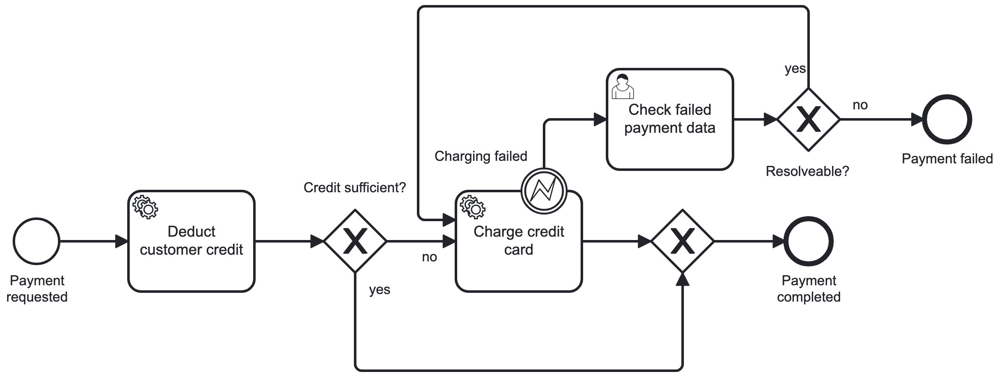

# Process Application for Camunda 7 using External Service Tasks

## The process



## Deployment

The Spring Boot process application deploys the process [on startup](src/main/java/com/camunda/consulting/ExternalTaskWorkerApplication.java).

## Create instances

you can create process instances with curl or any other  REST client:

```
curl --location 'http://localhost:8080/engine-rest/process-definition/key/PaymentProcess/start' \
--header 'Content-Type: application/json' \
--data '{
  "variables": {
    "orderTotal": {
      "value": 49.99,
      "type": "Double"
    },
    "customerId": {
      "value": "cust30",
      "type": "String"
    },
    "cardNumber": {
      "value": "1234 5678"
    },
    "CVC": {
      "value": "123"
    }, 
    "expiryDate": {
      "value": "09/24"
    }
  },
  "businessKey": "Worker test 3"
}'
```