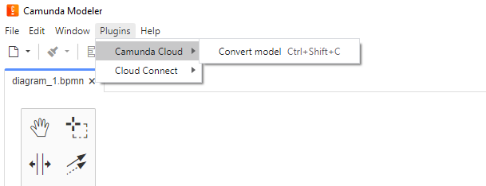
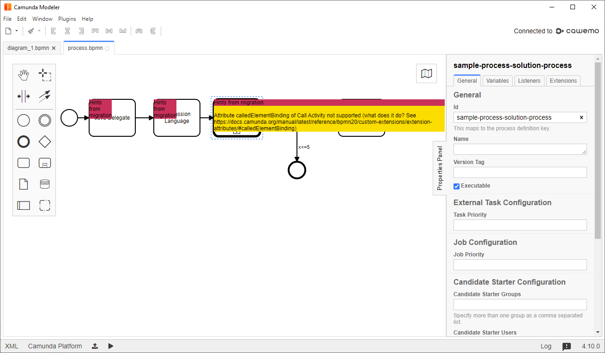

# Camunda Modeler Plugin to convert BPMN models from Camunda Platform to Camunda Cloud

This modeler plugin can convert BPMN models that were created for Camunda Platform into models can be executed on Camunda Cloud.

## Migrating elements and attributes

All technical attributes and extension elements that can be migrated in a meaningful way are migrated. Whenever attributes are not supported in Camunda Cloud a warning is shown on the respective element in the model. Details on how elements are migrated are described in the [upcoming migration guide](https://github.com/berndruecker/camunda-cloud-documentation/blob/migration-guide-initial-draft/docs/guides/migrating-from-Camunda-Platform.md).

**Important note:*** This plugin might not fully migrate your model, but it can give you a jump-start.

You can extended the [migration logic](client/ConvertToCamundaCloudPlugin.js#L194) easily to add your own custom migration rules.

## Migrating expressions

This plugin also migrates simple JUEL expressions of Camunda Platfom into FEEL expressions used in Camunda Cloud. You can have a look into [sample expressions in the test cases](client/JuelToFeelConverter.test.js) and might also want to extend the [expression converter](client/JuelToFeelConverter.test.js) to suite your needs.

# How to install and use

**Download the plugin** from the [release page](releases/latest). 

Pick the camunda-modeler-plugin-platform-to-cloud-converter.zip file and extract it into

* ```{path_to_modeler}/plugins```
* ```C:\Users\{user_name}\AppData\Roaming\camunda-modeler\resources\plugins (Windows)```
* ```/Users/{user_name}/Library/Application Support/camunda-modeler/plugins (Mac OS)```

The latter ways preserve the plugins when the modeler installation is replaced with a new version and allows to use the plugins from several installed versions. See also [Camunda Modeler plugins docs](https://github.com/camunda/camunda-modeler/tree/master/docs/plugins#plugging-into-the-camunda-modeler)

**Restart your Camunda Modeler**



You can now **convert a Camunda Platform BPMN Model** by going to Plugins -> Camunda Cloud -> Convert Model. You need to have the model open that you want to convert.

This does the convertion and adds hints to the model wherever appropriate:




# Building the plugin from the sources

If you want to build the plugin from the sources (e.g. because you extended the mirgation logic) simply do a:

```
npm update
npm run dev
```
