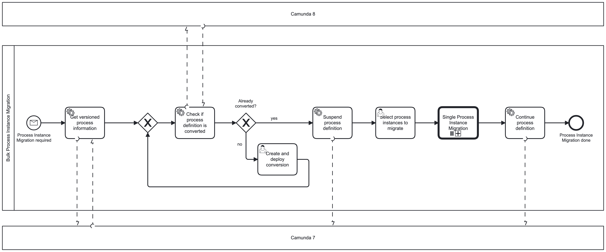
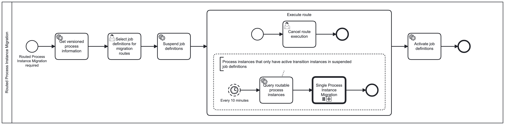

# Process Instance Migration

When migrating from Camunda 7 to Camunda 8, you might also require to migrate
instances of your converted process definition.

This is the purpose of this project.

## How to use

The tool built from the project has 2 modes:

- Single Process Instance Migration
- Routed Process Instance Migration

Both use a very basic process to migrate a process instance.

### Basic Process Instance Migration

For a given Camunda 7 process instance, all required data will be collected.

Then, the process instance is created in Camunda 8.

Finally, the transferred process instance is deleted in Camunda 7. In case this
goes wrong, the process instance is deleted in Camunda 8 instead.


### Single Process Instance Migration

The known way of migrating process instances. At one point in time, all selected
process instances are migrated.

For this, you enter a BPMN process id on start.

The **latest** version of this process definition will be found in your Camunda
7 instance.

Then, a check will be performed whether there is an equivalent in your Camunda 8
instance.

If there is no equivalent, you will be asked to create it.

If there is, you will be asked to select process instances that you want to
migrate. By this time, the whole process definition is suspended to prevent side
effects.

Then, all selected process instances will be migrated.

In the end, the process definition is continued.



### Routed Process Instance Migration

Process instances run in Camunda 7 until some defined points and are then
migrated from there.

For this, you enter a BPMN process id on start.

The **latest** version of this process definition will be found in your Camunda
7 instance.

As configuring routes may follow after a **Single Process Instance Migration**,
there will be no check if the process definition does already exist in
Camunda 8.

Then, you will be asked to create the router. The router consists of job
definitions that are fetched from your process definition. Here, it is important
to create a consistent route, meaning covering all possible flows in that route.

After the router is configured, it is started. The job definitions you selected
are suspended in Camunda 7 and every 10 minutes, the router searches for process
instances that have no more active tokens outside the routed job definitions.

For each of them, a migration is performed.

The router can be stopped by completing the **Cancel route execution** task.

After the router is stopped, the suspended job definitions are continued.



## Current Limitations

As of now, there are some limitations that will also be reflected in the webapp.

Please think about how a _temporary modification_ to an existing process
definition could help you to create a workaround for these limitations.

Process Definitions:

- Only **None Start Event**s can be used on process definitions that are to be
  migrated

Process Instances:

- No **Call Activity** instances can be migrated
- No timer states **Intermediate Timer Event**, **Timer Boundary Event**,
  **Event Subprocess Timer Start Event**, ...
- No multi-instances can be migrated
- No scoped variables can be migrated

## Technical Setup

The tool requires a connection to 3 different APIs:

- Camunda 7 REST API
- Zeebe gRPC API
- Camunda Operate REST API

These APIs can be configured by the following properties:

```yaml
# This is the spring zeebe starter client
zeebe:
  client:
    security:
      plaintext: true
    broker:
      gateway-address: localhost:26500
    request-timeout: PT60S

operate:
  client:
    # the base url of the Operate instance
    base-url: http://localhost:8081
    # Exactly one authentication is required
    authentication:
      # Self-managed without identity (dev setup)
      simple:
        username: demo
        password: demo
      # Saas Auth
      saas:
        client-id: q49wgt39üq4
        client-secret: sdoinsodv
      # Self-managed with Identity
      self-managed:
        client-id: q49wgt39üq4
        client-secret: sdoinsodv
        keycloak-url: https://keycloak.camunda-platform.myurl.com
        keycloak-realm: camunda-platform

camunda7:
  client:
    base-url: http://localhost:8080
    rest-api-context: engine-rest
    check-on-init: true
```
