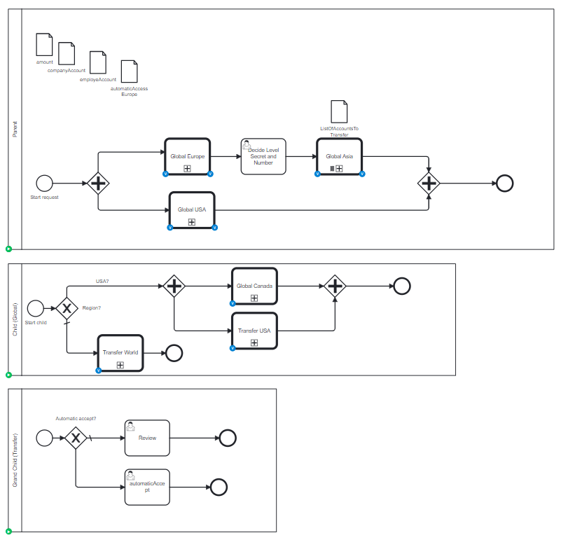

# Call Activity Complex

## Definition

This process creates multiple task in a sub-sub-process, comming from different way. The migration should recreate all tasks with the correct parent

automaticAcceptEurope=false  
listOfAccounts=["blue"]

| Type                 | path                                                              |
|----------------------|-------------------------------------------------------------------|
| strait               | Global Europe > Transfer World > Review                           | 
| via a different path | Global USA > Transfer USA > Review                                |
| via a recursive path | Global USA > Global Canada > Transfer World > Review              |

3 tasks is waiting.

To go to the instance, and have the previous execution, a second process instance, with
automaticAcceptEurope=true  
listAccounts=["blue", "red", "green", "yellow"]
and 
| Type                 | path                                                              |
|----------------------|-------------------------------------------------------------------|
| via a loop           | path europe - Global Asia (3 instances) > Transfer World > Review | 

4 task is waiting for the review from Asia, 2 from USA

## Expectation

Two task in the Child, variables are present at the parent and at the child level

## Diagram

## Follow up

| Date         | Who   | Status       |
|--------------|-------|--------------|
| Feb 24, 2023 | Pierre-Yves Monnet | Definition   |
