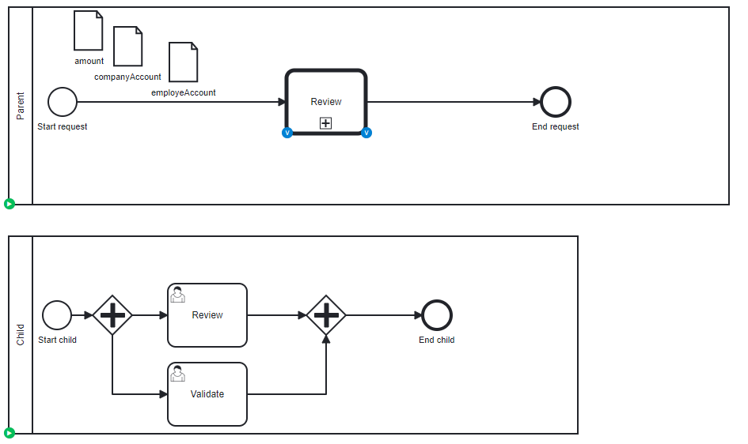

# Call Activity

## Definition
Two process, a parent and a child. Parent has a call activity, and during the call, different variables are passed.

| Parent variable | Type     | Child variable    | 
|-----------------|----------|-------------------|
| amount          | Double   | amountTransfer    |
| companyAccount  | String   | accountFrom       |
| employeeAccount | String   | accountTo         |
| employeeName    | String   |  *not transfered* |

## Expectation

Two task in the Child, variables are present at the parent and at the child level

## Diagram

## Follow up

| Date         | Who   | Status       |
|--------------|-------|--------------|
| Feb 16, 2023 | Pierre-Yves Monnet | Definition   |
