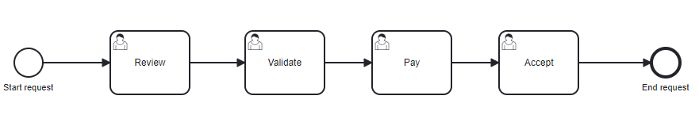

# Complex User Task

## Definition
This diagram consist with a a list of task in sequence. No process variables.

## Expectation

Process instances wait in the correct User task. No process variables is created.

## Diagram

## Follow up

| Date             | Who   | Status       |
|------------------|-------|--------------|
| Jan 29, 2023 | Pierre-Yves Monnet | Definition   |
