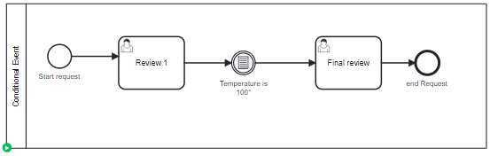

# Conditional Event

## Definition
A process instance is waiting at a conditional event.

The process has a process variable (temperature) under 100, so the process instance is waiting.

## Expectation

Still wait for the event

## Diagram

## Follow up

| Date         | Who   | Status       |
|--------------|-------|--------------|
| Feb 21, 2023 | Pierre-Yves Monnet | Definition   |
