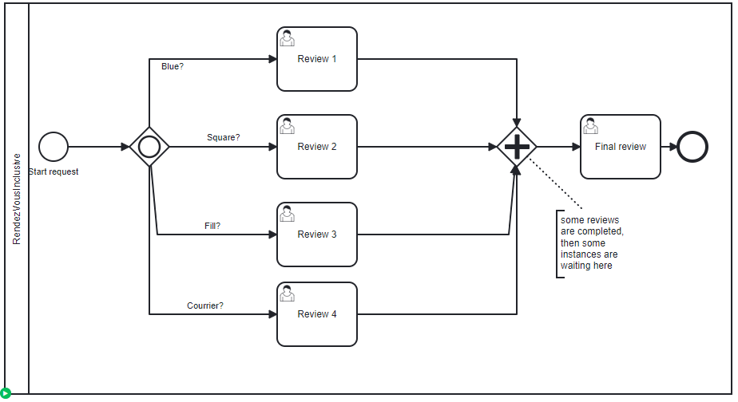

# Merging Inclusive

## Definition
Different process instances. For each, one token is still waiting.
The Review user is true every time, force the Inclusive gateway to wait.

* The first process instance, two conditions was true, one token is waiting.

* The second process instance get tree conditions true, two tokens are waiting

* The third process instance get four conditions true, three tokens are waiting

* A fourth process instance get four condition true, but only two tokens are waiting (Review and Blue are not executed).

## Expectation

For each process instance, the active review are executed, and the rendez vous works as expected.

## Diagram

## Follow up

| Date         | Who   | Status       |
|--------------|-------|--------------|
| Feb 16, 2023 | Pierre-Yves Monnet | Definition   |
