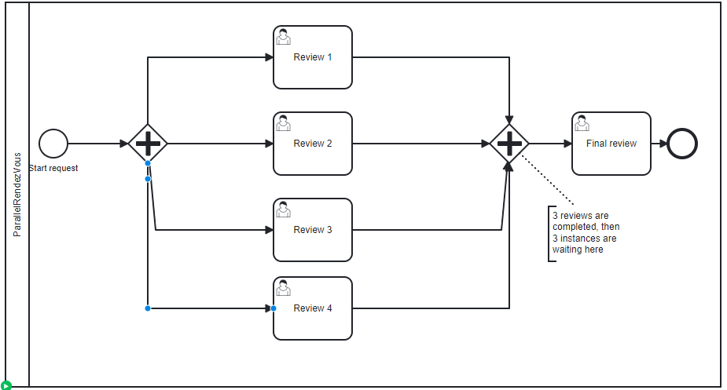

# Merging Parallel

## Definition
Some tokens are waiting in the parallel gateway. 
In this process instance, 3 review are executed, and then 3 tokens are in the merging gateway

## Expectation

When the last review is perform, the process instance must move to the "final review" task.

## Diagram

## Follow up

| Date         | Who   | Status       |
|--------------|-------|--------------|
| Feb 27, 2023 | Pierre-Yves Monnet | Definition   |
