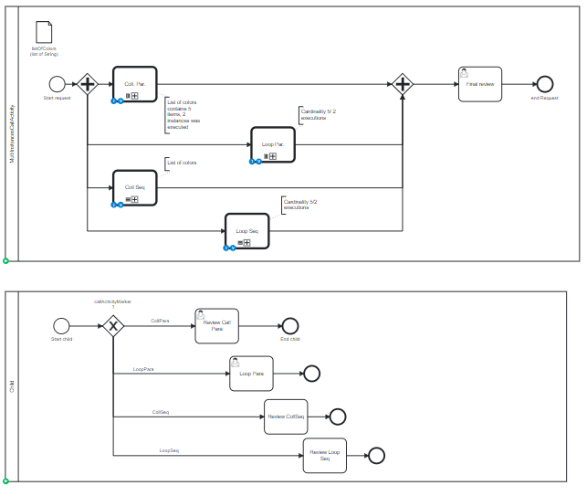

# Multi Instance Call Activity

## Definition
Four multi instance task are created, with all combinations:
* collection-parallel - 3 instances, 1 executed, 2 tasks active
* collection-sequential - 3 instances, 1 executed, 1 task active
* LoopCardinality-parallel - 5 instances, 2 executed, 3 tasks actives  
* LoopCardinality-sequential - 5 instances 1 executed, 1 task active

## Expectation

Seven tasks actives, and some task instances are already executed

## Diagram

## Follow up

| Date         | Who   | Status       |
|--------------|-------|--------------|
| Feb 21, 2023 | Pierre-Yves Monnet | Definition   |
