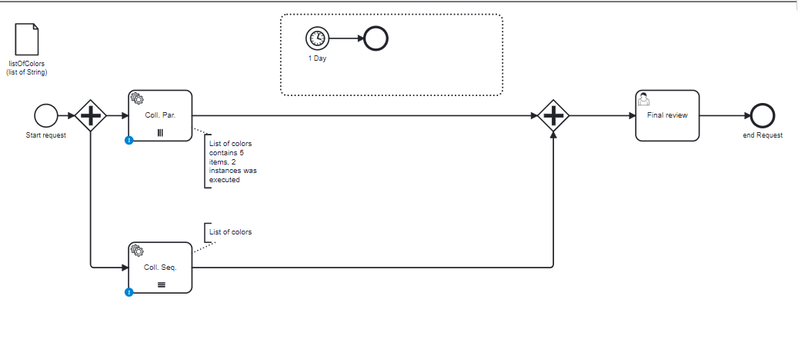

# Multi Instance Service Task Collection

## Definition
Four multi instance task are created, with all combinations:

| Name                   | use case               | Activity executed | Activity waiting    |
|------------------------|------------------------|-------------------|---------------------|
| collection-parallel    | collection of 5 colors | 1 executed        | 4 actives           |
| collection-sequential  | Collection of 5 colors | 3 executed        | 1 active, 2 futures | 

## Expectation

Five tasks actives, and some task instances are already executed

## Diagram

## Follow up

| Date          | Who                | Status                                             |
|---------------|--------------------|----------------------------------------------------|
| Feb 21, 2023  | Pierre-Yves Monnet | Definition                                         |
| March 9, 2023 | Pierre-Yves Monnet | Split to create Loop Card and Collection (2 tests) |

