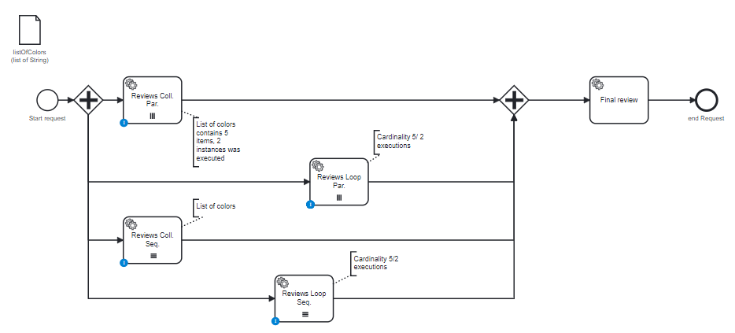

# Multi Instance Service Task

## Definition
Four multi instance task are created, with all combinations:

| Name                   | use case               | Activity executed | Activity waiting    |
|------------------------|------------------------|-------------------|---------------------|
| collection-parallel    | collection of 5 colors | 1 executed        | 4 actives           |
| cardinality-parallel   | Cardinalité 17         | 2 executed        | 15 actives          |
| collection-sequential  | Collection of 5 colors | 3 executed        | 1 active, 2 futures | 
| cardinality-sequential | Cadrinatity 9          | 4 executed        | 1 active, 4 futures |

## Expectation

Four tasks actives, and some task instances are already executede

## Diagram

## Follow up

| Date         | Who   | Status       |
|--------------|-------|--------------|
| Feb 21, 2023 | Pierre-Yves Monnet | Definition   |
