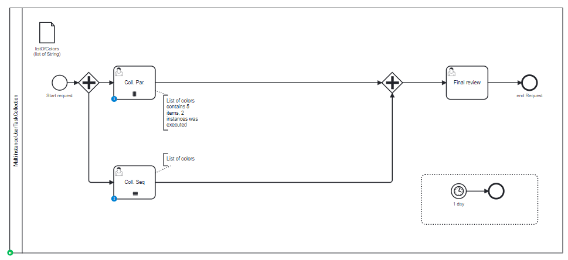

# Multi instances User Task Collection

## Definition
Four multi instance task are created, with all combinations:

| Name                   | use case               | Activity executed | Activity waiting    |
|------------------------|------------------------|-------------------|---------------------|
| collection-parallel    | collection of 5 colors | 1 executed        | 4 actives           |
| collection-sequential  | Collection of 5 colors | 3 executed        | 1 active, 2 futures | 

## Expectation

4 + 1 tasks actives

## Diagram

## Follow up

| Date         | Who   | Status       |
|--------------|-------|--------------|
| Feb 16, 2023 | Pierre-Yves Monnet | Definition   |
