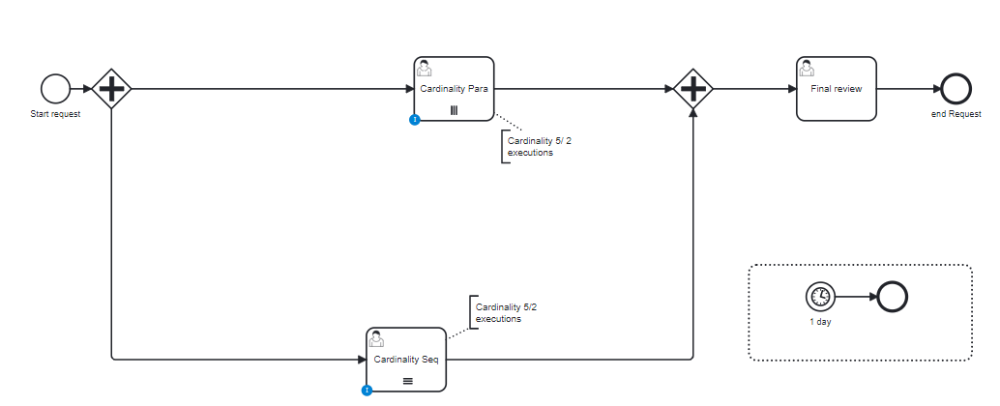

# Multi instances User Task Loop Cardinality

## Definition
Four multi instance task are created, with all combinations:

| Name                   | use case               | Activity executed | Activity waiting    |
|------------------------|------------------------|-------------------|---------------------|
| cardinality-parallel   | Cardinality 17         | 2 executed        | 15 actives          |
| cardinality-sequential | Cadrinatity 9          | 4 executed        | 1 active, 4 futures |

## Expectation

2 tasks actives

## Diagram

## Follow up

| Date         | Who   | Status       |
|--------------|-------|--------------|
| Feb 16, 2023 | Pierre-Yves Monnet | Definition   |
