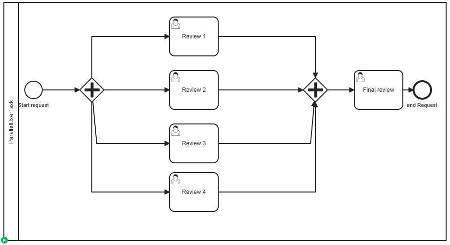

# Parallel User Task

## Definition
A process instance is created, and four tasks are actives

## Expectation

Four tasks actives

## Diagram

## Follow up

| Date         | Who   | Status       |
|--------------|-------|--------------|
| Feb 16, 2023 | Pierre-Yves Monnet | Definition   |
