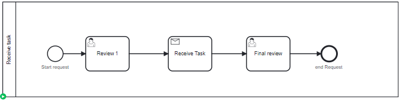

# Receive Task

## Definition
A process instance is waiting at receive task

## Expectation

Still wait for the message

## Diagram

## Follow up

| Date         | Who   | Status       |
|--------------|-------|--------------|
| Feb 21, 2023 | Pierre-Yves Monnet | Definition   |
