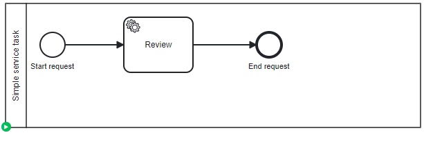

# Simple service task

## Definition
The process contains a service task. After migration, service task must be available

## Expectation

Service task available

## Diagram

## Follow up

| Date         | Who   | Status       |
|--------------|-------|--------------|
| Feb 21, 2023 | Pierre-Yves Monnet | Definition   |
