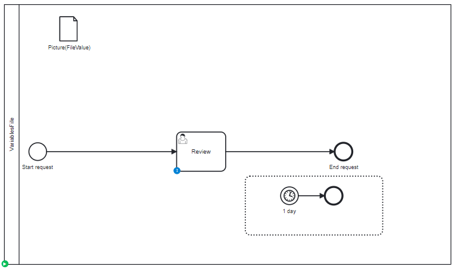

# Call Activity

## Definition
A process with different kind of variable:
* File

## Expectation

Variables are migrated, on process and on task level.

## Diagram

## Follow up

| Date           | Who                | Status                           |
|----------------|--------------------|----------------------------------|
| Feb 16, 2023   | Pierre-Yves Monnet | Definition                       |
| March 9, 2023  | Pierre-Yves Monnet | Split variables in multiple test |
