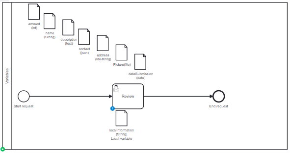

# Call Activity

## Definition
A process with different kind of variable:
* Long
* String
* Text (long string)
* Json
* List of String
* File
* Date

## Expectation

Variables are migrated, on process and on task level.
Text (too long string) can't be migrated
Picture (too long variable) can't be migrated

## Diagram

## Follow up

| Date         | Who   | Status       |
|--------------|-------|--------------|
| Feb 16, 2023 | Pierre-Yves Monnet | Definition   |
