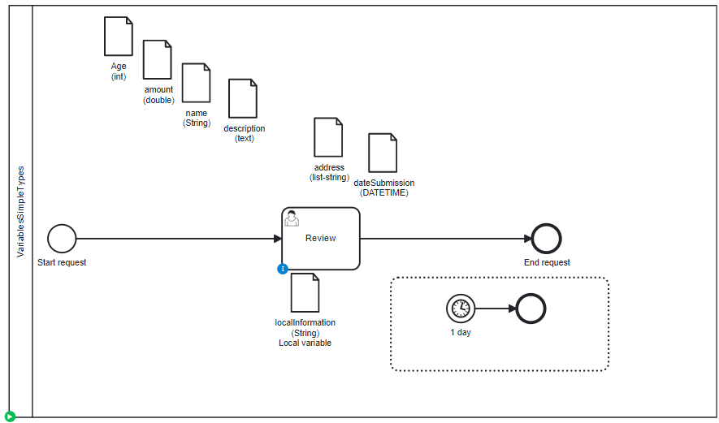

# Variables Simple Types

## Definition
A process with different kind of variable:
* Long
* String
* Text (long string)
* List of String
* Date

## Expectation

Variables are migrated, on process and on task level.
Text (too long string) can't be migrated

## Diagram

## Follow up

| Date           | Who                | Status                           |
|----------------|--------------------|----------------------------------|
| Feb 16, 2023   | Pierre-Yves Monnet | Definition                       |
| March 9, 2023  | Pierre-Yves Monnet | Split variables in multiple test |
